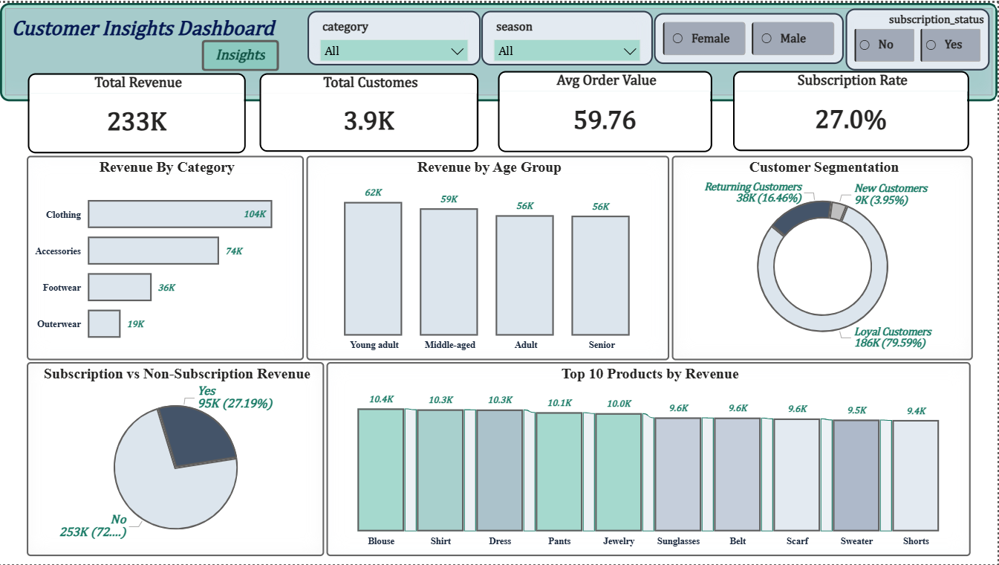

# Customer Analytics & Insights | Python, SQL & Power BI

---
## 📌 Overview

Customer Analytics & Insights is an end-to-end analytics project that analyzes customer purchasing behavior, customer value, loyalty patterns, and product performance.

The project combines Python, SQL, and Power BI to transform raw customer transaction data into actionable business insights.

---

## 🔄 Project Workflow

Raw Data
↓

Data Cleaning & Exploration (Python)
↓

Business Analysis (SQL)
↓

Interactive Dashboard (Power BI)
↓

Business Insights & Recommendations

---
## 🛠️ Tools & Technologies

- Python (Pandas, NumPy)
- SQL (MySQL)
- Power BI
- DAX

---

## 🧹 Data Preparation (Python)

- Loaded and explored customer transaction data using Pandas.
- Performed data validation and quality checks.
- Analyzed missing values and duplicate records.
- Prepared the dataset for SQL analysis and dashboard reporting.

---

## 📊 SQL Analysis

### Business Overview
- Revenue by Gender
- Revenue by Category
- Revenue by Age Group
- Customer Segmentation

### Customer Value Analysis
- Subscription Impact Analysis
- High-Value Customer Identification
- Top Revenue Customers Ranking
- Customer Lifetime Value (CLV)

### Customer Loyalty Analysis
- Subscription Adoption Among Repeat Buyers
- RFM Segmentation
- Churn Risk Analysis
- Revenue Quartile Analysis

### Product Performance Analysis
- Best-Selling Products
- Top-Rated Products
- Product Revenue vs Rating Analysis
- Discount Dependency Analysis
---

## 📈 Power BI Dashboard

  
  

### Executive Dashboard

**KPIs**
- Total Revenue
- Total Customers
- Average Order Value
- Subscription Rate

**Visuals**
- Revenue by Category
- Revenue by Age Group
- Customer Segment Contribution
- Subscription vs Non-Subscription Revenue
- Top Products by Revenue
- Revenue by Season

### Customer & Product Insights

**Visuals**
- Top Customers by Revenue
- Churn Risk Analysis
- Customer Revenue Quartiles
- Product Revenue vs Rating Analysis
- Discount Dependency Analysis

---

## 🔍 Key Insights

- Loyal customers contribute the largest share of revenue.
- Subscription customers spend more on average than non-subscribers.
- Revenue is concentrated among a small group of high-value customers.
- Repeat buyers demonstrate stronger customer loyalty.
- Several highly rated products present growth opportunities.
- Some products rely heavily on discounts.

---

## 🚀 Skills Demonstrated

### Python
- Pandas
- NumPy
- Data Cleaning
- Exploratory Data Analysis (EDA)

### SQL
- CTEs
- Subqueries
- Window Functions
- Aggregations
- Customer Segmentation

### Power BI
- DAX Measures
- KPI Development
- Interactive Dashboards
- Data Modeling

### Analytics
- Customer Analytics
- Customer Lifetime Value (CLV)
- Churn Analysis
- Product Analytics
---

## 👤 Author

**Shahid Ali**

Data Analyst | SQL | Power BI | Python | Excel

GitHub: https://github.com/shahidali0101
